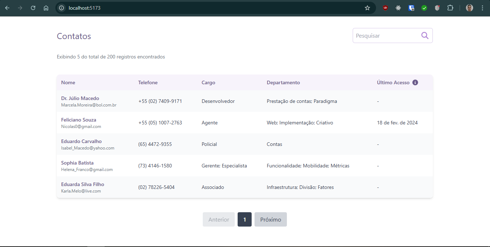

<p align="center">
	
</p>

# Desafio Frontend Inovação Febrafar

Teste tecnico para vaga de front-end developer

## Visão geral dos item feitos

- [x] Construa uma página que possua a listagem no formato de tabela com as seguintes colunas: Nome (com email abaixo) | Telefone | Cargo | Departamento | Último acesso
- [x] Elementos na página, como Título, campo de busca, paginação e rótulo
- [x] Implemente uma funcionalidade de paginação que permita navegar entre as páginas de registros
- [x] Implemente uma funcionalidade de busca que encontre os registros por email, nome ou telefone.
- [ ] Permita que o botão "Exportar" gere um arquivo em formato Excel com os dados da tabela.

## Captura de tela



## Links

- URL do repositório: [Repositório](https://github.com/Samuel-Amaro/hangman-game)
- URL da solução: [Jogo Da Forca](https://hangman-game-five-xi.vercel.app/)

## Meu processo

### Construído com

- Marcação HTML5 semântica
- Talwind
- TypeScript
- [Svelte](https://svelte.dev/docs/introduction)
- [SvelteKit](https://kit.svelte.dev/docs/introduction)

### Criado um projeto

como criar um novo projeto sveltekit

```bash
# cria um novo projeto no diretório atual
npm create svelte@latest

# cria um novo projeto em my-app
npm create svelte@latest my-app
```

### Desenvolvimento

Depois de criar um projeto e instalar dependências com `npm install` (ou `pnpm install` ou `yarn`), inicie um servidor de desenvolvimento:

```bash
npm run dev

# ou inicie o servidor e abra o aplicativo em uma nova aba do navegador
npm run dev ---open
```

### Building

Para criar uma versão de produção do seu aplicativo:

```bash
npm run build
```

### Scripts

#### Format, Lint, Check

Formatar o código (Prettier)

```bash
npm run format
```

---

Executar o Lint

```bash
npm run lint
```

---

Executar a verificação do Svelte

```bash
npm run check #or
npm run check:watch
```
